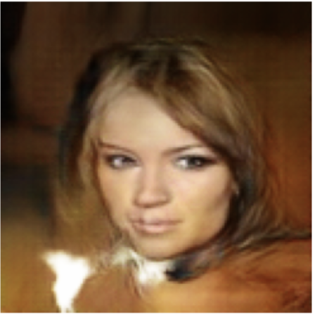

# FaceGenerator

## Solution Description

In this project, a Conditional Deep Convolutional Generative Adversarial Network (cDCGAN) is implemented and trained on the CelebA dataset [1]. The dataset contains 202,599 images of faces of various celebrities (only 40,960 were actually used for training due to memory constraints). Out of these 202,599 images, there are 10,177 unique identities (names of identities are not included). There are 40 binary attributes describing the images, but only one is used for this project: whether the image is of a male or female.

The chosen architecture for the generator is inspired by the architecture presented in the original DCGAN paper [2] and illustrated in Figure 1. The main difference is that the implementation for this project uses an 8x8 foundation instead of a 4x4 leading to 128x128 pixel output images. Conditioning the network on whether the images is of a male or female is done using an embedding layer.

**Figure 1:** Inspiration for the DCGAN generator used for generating images of human faces [2].

A few different architectures and hyperparameters have been tested, mainly inspired by the architecture guidelines for stable Deep Convolutional GANs in the DCGAN paper. Recommendations that showed good results include:

- Replacing pooling layers with strided convolutions in the discriminator.
- Using LeakyReLU activation in the discriminator and generator for all layers (except the output layers).
  
Other guidelines did not show any noticeable improvements and some even decreased the quality of the generated images such as the use of batch normalization in the generator. Different learning rates were also tested and the ones that produced the best results were 0.0002 and 0.0003 with the Adam optimizer and out of these two 0.0002 was used to train the final model.

## Sample Images

A few example images generated by the final model, trained on 40,960 images for 259 epochs, are displayed in Figure 2.

|  |  |  |
|:---------------------------:|:---------------------------:|:---------------------------:|
| Male 1                      | Male 2                      | Male 6                      |

|  |  |  |
|:-------------------------------:|:-------------------------------:|:-------------------------------:|
| Female 1                        | Female 2                        | Female 3                        |

**Figure 2:** Generated images of males and females.

## References
[1] J. Li, Celebfaces attributes (celeba) dataset, https://www.kaggle.com/datasets/jessicali9530/celeba-dataset. (visited on 05/29/2024).

[2] A. Radford, L. Metz, and S. Chintala, “Unsupervised representation learning with deep convolutional generative adversarial networks,” arXiv preprint arXiv:1511.06434, 2015.